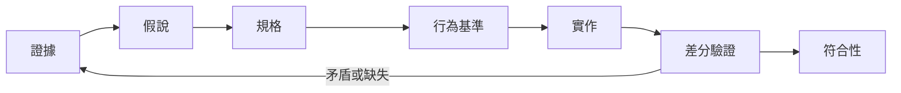

# 00　先證明題目，再證明答案

[目錄](README.md) · [下一章](01-evidence.md)

AI 很容易把一個合理故事寫成可以執行的程式。軟體考古的困難在於，你不只要一個答案，
還要知道它是否解釋了原有系統。沒有來源的常數、根據畫面猜出的欄位、只驗自己輸出的測試，
都可能把猜測固定成看起來很可靠的工程產物。

因此先定義你要重現的行為：哪個版本、哪些輸入、哪段流程、哪些可見結果。
「完整重製」不是可直接測試的題目；「這個版本從新局選單走到神殿時，座標與對話是否一致」才有實驗邊界。

## 三種不同的成功

| 聲明 | 需要的證據 | 不能順便證明 |
|---|---|---|
| 程式內部自洽 | 解析、狀態轉移、邊界條件等局部測試 | 規則就是原版規則 |
| 與指定參考一致 | 同版本、同輸入、同狀態下的差分結果 | 未測案例、其他平台或真實硬體全部一致 |
| 使用者能完成流程 | 正式產物從正常入口操作至結果 | 每個內部欄位都與原版相同 |

MM2 曾有離屏畫面測試與封包啟動檢查都沒發現的空白文字問題：文字在最後送進顯示層時被清掉。
缺的是產品出口的證據，而不是再多跑幾次同一組局部測試。案例 M1 也提醒我們，不應把不同種類的通過數加成一個完成百分比。

## 一條可回查的工作鏈

每一步留下下一步需要的產物。原始觀測支持主張，主張支持規格，規格指出要比較什麼，
比較報告支持有範圍的符合性。若把中間連結省略，只剩「測試全綠」，接手者就無法知道測試在證明什麼。

實驗可以回頭，也可以先做隔離的原型取得觀測；不能把實驗性解釋直接移入正式路徑。
當新證據推翻前提時，回到受影響的規格，不在程式或測試裡偷偷換答案。

## 四個每日可用的問題

1. 這一句話是觀察、推論，還是我們自己的設計？
2. 哪個相反結果會讓我們承認它錯了？
3. 測試能看見這個錯誤發生的位置嗎？
4. 今天的結果只對哪些版本、案例與欄位成立？

若第四題答不出來，先縮小聲明，而不是省略限制。縮小聲明不能替代完成使用者原先要求的功能；
尚未覆蓋的工作要明列為未完成，不能從清單消失。

## 從一個窄問題開工

用一小段正常流程建立垂直鏈：原始輸入 → 解碼資料 → 規則 → 使用者介面 → 儲存／輸出 → 比較。
只要某一環沒經過，便不能用前一環的結果代替它。對沒有介面或存檔的工具，明確寫不適用及理由。

不用把整支執行檔翻譯完才開始。證據已足以實作並驗證目前功能，就收斂這個切片；
不相關的初始化樣板與硬體細節只保留定位。剩餘未知是否影響交付，由規格範圍與使用者目標判斷。

### 來源與主張範圍

[M1、M3、P2](../inventory.md#固定來源索引)提供測試覆蓋缺口、原版路線與規格閘門的來源紀錄。
`CONFIRMED` 只指這些紀錄及所述文件規則已核對；三種成功的分法是 `STRONG_INFERENCE` 的方法整理。
它們不構成所有考古專案的成功保證。
