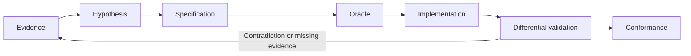

# 00 — Establish the Question Before the Answer

[Contents](README.md) · [Next](01-evidence.md)

An AI can turn a plausible story into executable code. Software archaeology requires more: you must know whether that story explains the existing system. Unsupported constants, field names guessed from a screen, and tests that check only the implementation's own expectations can make speculation look like sound engineering.

Define the behavior first: which version, inputs, path, and observable results? “A complete remake” is a goal, not a directly testable question. “For this version, do coordinates and dialogue agree when replaying the route from a fresh-game menu to the temple?” has an experimental boundary.

## Three distinct successes

| Claim | Required evidence | What it does not also establish |
|---|---|---|
| Internally consistent | Local checks of parsing, transitions, and boundaries | That the rules are the original rules |
| Agrees with a declared reference | Differential results for the same version, inputs, and state | Agreement for untested cases, other platforms, or physical hardware |
| Users can complete a path | The delivered artifact, normal entry, actions, and resulting output | Equality of every internal field with the original |

MM2 had a blank-text problem that offscreen tests and package startup checks missed: text was cleared in the final display transfer. The missing evidence concerned the product's output boundary. Repeating the same local tests would not cover it. M1 also illustrates why unlike kinds of passing checks should not be added into one completion percentage.

## A traceable chain

Each step leaves an artifact for the next. Observations support claims; claims support a specification; the specification defines comparisons; comparison reports support bounded conformance. If those links disappear behind “all tests passed,” the next engineer cannot determine what the tests establish.

Experiments may go backward, and isolated prototypes may help obtain observations. Experimental interpretations must not silently enter production. When evidence contradicts an assumption, revisit the affected specification instead of changing the answer inside code or tests.

## Four everyday questions

1. Is this sentence an observation, an inference, or our own design?
2. What contrary result would make us admit it is wrong?
3. Can the test observe the point where the error would occur?
4. Which versions, cases, and fields does today's result actually cover?

If the fourth answer is missing, narrow the claim and state the limitation. Narrowing a claim does not replace completing the user's requested feature. Uncovered work must remain visible as incomplete.

## Start with a narrow, complete path

Build a vertical chain: raw input → decoded data → rule → interface → storage/output → comparison. Evidence for one link cannot stand in for a link that was never exercised. For tools without an interface or persistence, state that those links are inapplicable and explain why.

You need not translate the whole executable before starting. Once evidence is sufficient to implement and verify the current slice, finish it. Keep only the necessary location information for unrelated initialization or hardware details. Whether remaining unknowns block delivery depends on the specification and the user's objective.

### Sources and claim scope

[M1, M3, P2](../../inventory.md#固定來源索引) document the coverage gap, original-program route, and specification gates. `CONFIRMED` refers to inspection of these records and rules. The three-way distinction is a `STRONG_INFERENCE` methodological synthesis, not a guarantee of project success.
