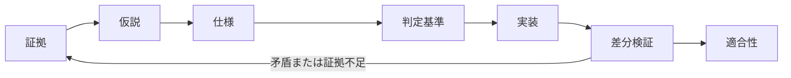

# 00　答えの前に、何を確かめるかを定める

[目次](README.md) · [次の章](01-evidence.md)

AI は、もっともらしい説明を実行可能なコードにできます。ソフトウェア考古学では、その説明が既存のシステムを本当に説明しているかを確かめなければなりません。根拠のない定数、画面から推測したフィールド名、自分の出力だけを検査するテストは、推測を信頼できそうな成果物に変えてしまいます。

最初に対象の動作を定めます。どの版、どの入力、どの経路、どの観測結果でしょうか。「完全なリメイク」は目標ですが、そのまま検査できる問いではありません。「この版で新規開始のメニューから神殿まで進むと、座標と会話が一致するか」なら実験の境界があります。

## 三種類の成功

| 声明 | 必要な証拠 | 同時には証明しないこと |
|---|---|---|
| 内部で整合している | 解析、状態遷移、境界条件などの局所検査 | 規則が原版の規則であること |
| 指定した参照と一致する | 同じ版、入力、状態での差分結果 | 未検査の事例、別のプラットフォーム、実機での一致 |
| 利用者が経路を完了できる | 配布物の通常入口から操作した結果 | 全内部フィールドが原版と同じこと |

MM2 では、オフスクリーン検査とパッケージの起動確認が通っても、最後の表示転送で文字が消え、利用者には空欄が見える問題がありました。足りなかったのは製品の出力境界の証拠です。同じ局所テストを繰り返しても、その境界は通りません。異なる種類の成功数を一つの完成率に足し合わせるべきでないことも、この M1 の事例から分かります。

## 追跡できる一連の流れ

各段階は次に必要な成果物を残します。観測が主張を支え、主張が仕様を支え、仕様が比較対象を定め、比較報告が限定された適合性を支えます。途中が消えて「全テスト成功」だけになると、引き継ぐ人は何を証明したのか判断できません。

実験では前の段階に戻ってよく、隔離した試作で観測を得ることもできます。ただし実験中の解釈を黙って正式経路に入れてはいけません。新しい証拠が前提を否定したら、コードやテストの中で答えを変えるのではなく、該当する仕様に戻ります。

## 日々の四つの問い

1. この文は観測、推論、それとも自分たちの設計か。
2. どのような反対の結果なら、誤りを認めるか。
3. テストは、その誤りが生じる場所を観測できるか。
4. 今日の結果は、どの版、事例、フィールドにだけ当てはまるか。

四つ目に答えられなければ、声明を限定し、制約を記します。ただし声明を限定しても、依頼された機能を完了する責務はなくなりません。未検査の作業は未完了として残します。

## 狭くても端までつながった経路から始める

生の入力 → 復号データ → 規則 → 画面 → 保存／出力 → 比較、という縦のつながりを作ります。通っていない箇所を、その手前の証拠で代用できません。画面や保存のないツールなら、対象外である理由を記します。

実行ファイル全体の翻訳を終える必要はありません。現在の機能を実装し検証するのに十分な証拠があれば、その切片を収束させます。関係のない初期化やハードウェアの細部は必要な位置情報だけ残します。残る不明点が納品を妨げるかは、仕様と利用者の目標に基づいて判断します。

### 出典と主張の範囲

[M1、M3、P2](../../inventory.md#固定來源索引)は検査範囲の穴、原版の経路、仕様ゲートの記録です。`CONFIRMED` は記録と規則の確認を指します。三種類の成功という整理は `STRONG_INFERENCE` であり、全プロジェクトの成功保証ではありません。
